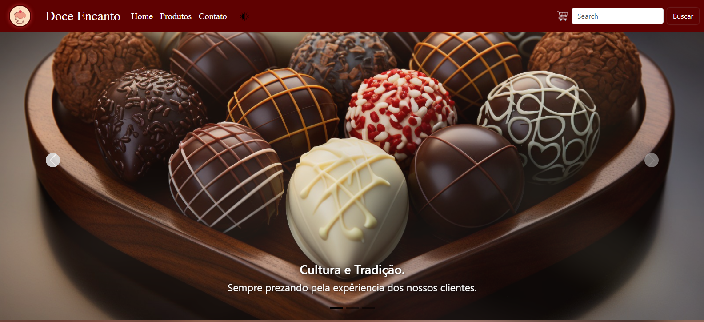
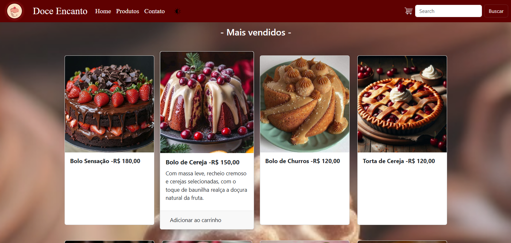
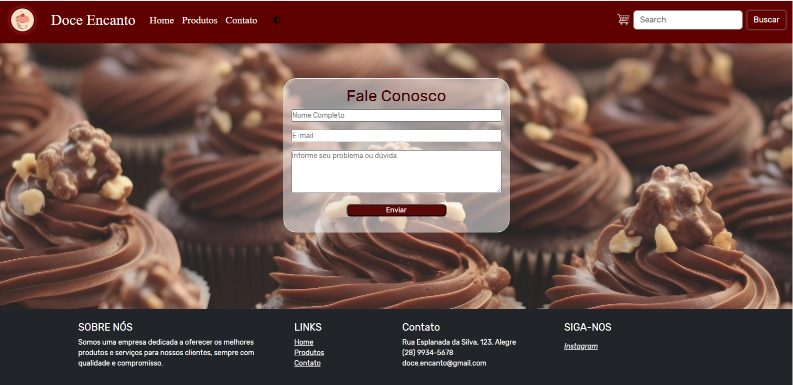
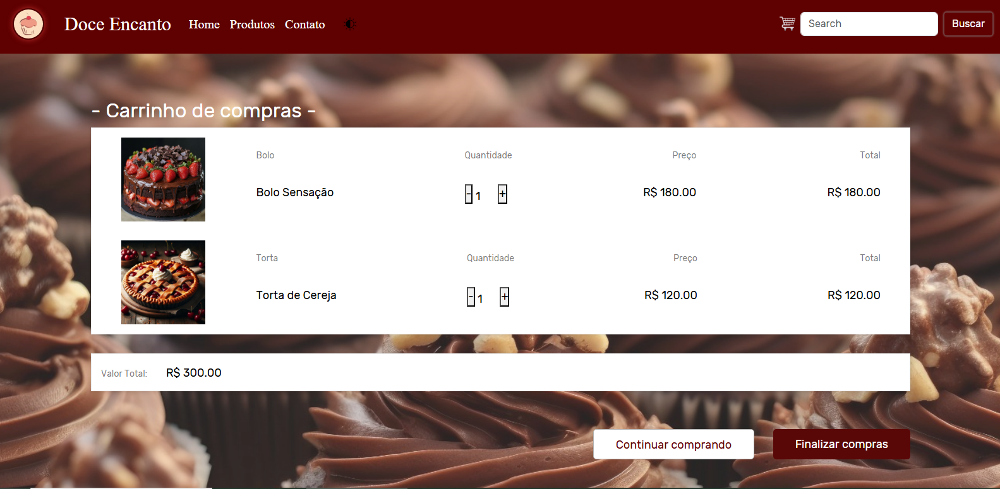
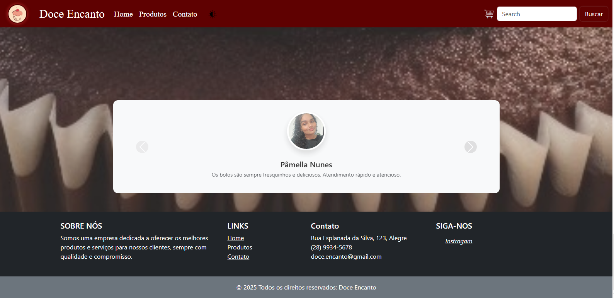
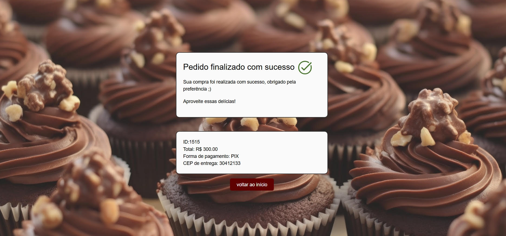

- Trabalho de Programação para Internet -

🍬 Doce Encanto - E-commerce de Doceria

Projeto desenvolvido para a disciplina Programação para Internet do IFES - Campus de Alegre, com o objetivo de aplicar os conhecimentos em HTML, CSS, JavaScript e Bootstrap.
Trata-se de uma loja virtual fictícia e estática para venda de doces artesanais, oferecendo uma experiência completa de navegação e compra.

## 🧁 Visão Geral

O site Doce Encanto simula um e-commerce de doceria, com foco em usabilidade, responsividade e organização do front-end. Entre as páginas e recursos implementados estão:

- Página inicial com destaques: com carrousel interativo sobre a doceria, categoria dos mais vendidos da loja, como também as novidades, embaixo tem as informações sobre a doceria, como entrar em contato com a mesma, além da rede social (fake).

- Catálogo de doces: com todos os doces que vendem na loja, nele encontra-se grande variedade de produtos,todos com link para encaminhar ao carrinho de compras.

- Carrinho de compras interativo: uma pequena simulação de quando se adiciona o produto ao carrinho, mostrando as informações do produto bem como valor, e caso o usuário queira aumentar a quantidade de pedidos é simulado automáticamente pelo javascript!

- Formulário de contato: caso o usuário tenha algum pedido em especial para fazer a loja, como uma quantidade maior do que a permetida na hora de fazer o pedido, tema opção de contato, ou até memso dúvidas sobre qualquer coisa!

- Página de finalização de pedido: assim que o usuário confirma o pedido é gerado um comprovante com todas as informações sobre o pedido, também utilizando o javascript para interligar o carrinho com a finalização do pedido, mostrando o valor da compra!

## 🖥️ Funcionalidades

- Layout 100% responsivo;
- Carrinho de compras com JavaScript;
- Confirmação de pedido com JavaScript;
- Formulário de contato funcional (sem backend);
- Uso de imagens reais para os produtos;
- Estilização com CSS customizado e Bootstrap.

## 🔧 Tecnologias utilizadas

NAVBAR, CARROSEL, CARDS...
Pegamos esses templetes prontos no
bootstrap normal: https://getbootstrap.com/

CARRINHO DE COMPRAS
Pegamos o template no site deles!
boostrap 4: https://bbbootstrap.com/snippets/ecommerce-shopping-cart-30657531

CARROSEL DEPOIMENTOS
Pegamos o template de depoimentos deles!
MDB bootstrap: https://mdbootstrap.com/docs/standard/extended/testimonial-slider/

Utilizamos javascript no carrinho para calcular as compras, na página de compravação do pedido, e também utilizamos na parte de mudança de tema do nosso site.
(como não tivemos aulas sobre o js, utilizamos o chat para fazer essa parte!)

- HTML5
- CSS3
- JavaScript
- Bootstrap

## 📁 Estrutura do Projeto

/trabalho e-commerce
│
├── index.html
├── catalogo.html
├── carrinho.html
├── contato.html
├── conclusao_pedido.html
│
├── /css
│ ├── style.css
│ └── bootstrap.css
│
├── /js
│ └── script.js
│
├── /img
│ └── (imagens dos produtos e ícones)

## ▶️ Como executar localmente

1. Baixe a pasta compactada.
2. Abra o projeto no Visual Studio Code.
3. Instale a extensão Live Server (caso ainda não tenha).
4. Clique com o botão direito no arquivo 'index.html' e selecione Open with Live Server.
5. O site será aberto automaticamente no navegador.

## 📸 Imagem do projeto

-Imagem da página principal 

-Imagem dos mais vendidos 

-Imagem do cátalogo de produtos

-Imagem de contato  

-Imagem do carrinho de compras 

-Imagem do carrousel com depoimentos de clientes

-Imagem quando finaliza a compra

## 👩‍💻 Autores

Projeto desenvolvido por Maria Luiza Ramos Caliman, Pâmella da Silva Nunes Batista e Mikael Vieira Casoti, estudantes de Análise e Desenvolvimento de Sistemas no IFES - Campus Alegre.
